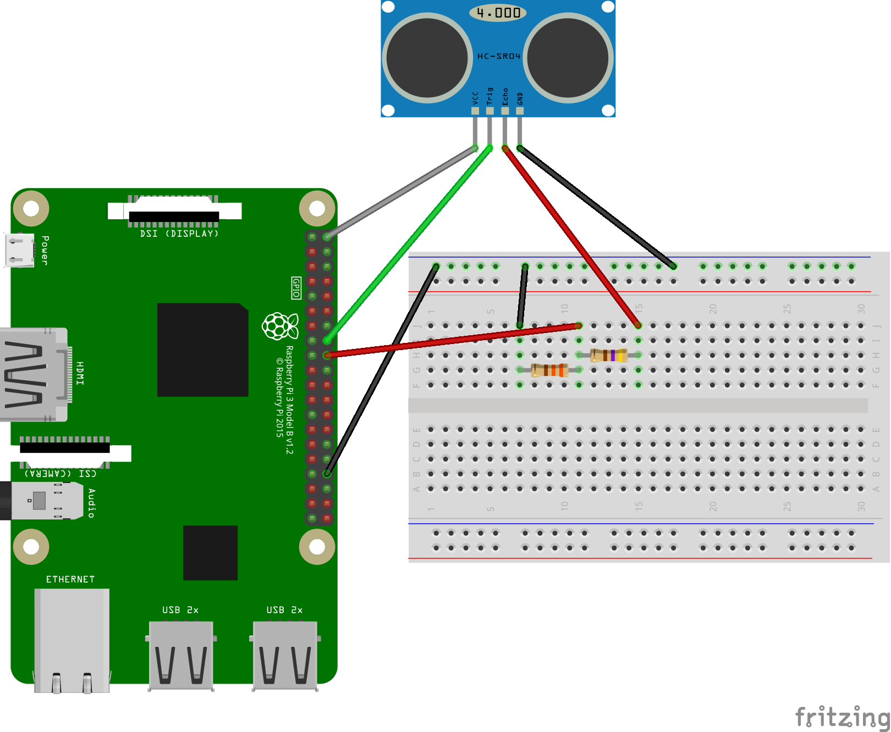
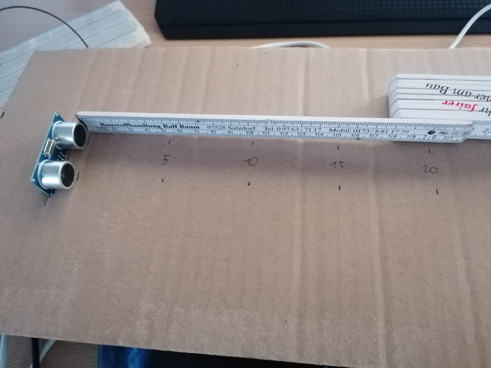
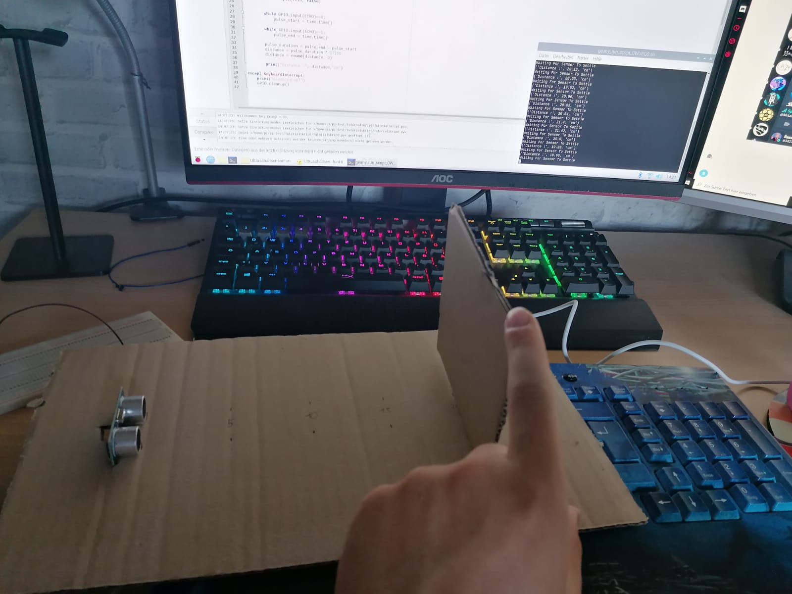
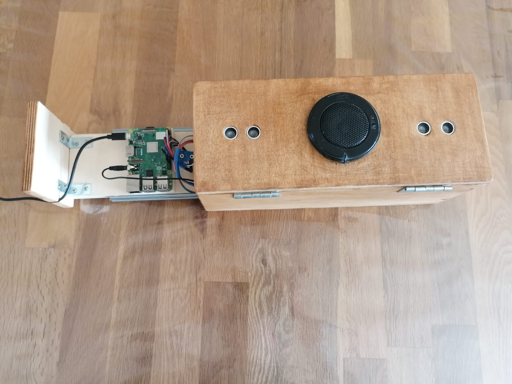

# Ultrasound-Based Theremin with Raspberry Pi

In my high school project, I built an ultrasound-based Theremin using a **Raspberry Pi 3** and **ultrasonic sensors**. The Theremin is an electronic musical instrument that is typically played without physical contact, using the hands' position relative to antennas to control pitch and volume. My goal was to recreate this functionality using ultrasonic sensors instead of the traditional electromagnetic fields, while maintaining the unique, eerie sound for which the Theremin is known.

## Project Overview

### Key Components
- **Raspberry Pi 3**: The central processing unit responsible for running the software that controls the sensors and generates sound.
- **Ultrasonic Sensors (HC-SR04)**: These sensors were used to detect hand position. One sensor measured the distance of the hand to control the pitch, and the second sensor controlled the volume.
- **Pygame Library**: This Python library was used for audio playback. I mapped distances from the sensors to pre-recorded piano notes, allowing the instrument to play sound based on hand movement.
- **Wooden Enclosure**: A custom-built housing was made to contain the electronics, with two drilled openings for the ultrasonic sensors and space for the audio output.

### Electronics and Circuit Design
The circuit was relatively simple but required careful configuration to ensure accurate distance measurement and sound generation. The **HC-SR04 sensors** were both connected to the GPIO pins of the Raspberry Pi in the following way:

Each sensor had a specific role:
- **Sensor 1**: Controlled the pitch of the sound by measuring the distance from the player's hand. The distance was mapped to specific musical notes. For example, moving the hand closer to the sensor would produce a higher pitch, while moving it farther away would lower the pitch.
- **Sensor 2**: Controlled the volume in a similar way, adjusting the loudness of the sound based on hand distance. When the hand was close, the volume was low, and as the hand moved away, the volume increased.

The sensors worked by emitting ultrasonic pulses and measuring the time it took for the sound to bounce back after hitting the hand. This allowed for precise distance measurement, which was then used to control sound parameters.

### Software Implementation
The project was programmed using **Python**. The software was responsible for reading data from the ultrasonic sensors, processing the measurements, and converting them into corresponding sounds. I used the **Pygame** library to play pre-recorded piano notes, mapping specific distances to individual notes. The program also accounted for volume control, ensuring that the sound output matched the distance detected by the second sensor.

### Distance Testing Process
To ensure the accuracy of the sensors, I conducted multiple distance tests. Using a simple setup, I marked specific distances from the sensors and tested their ability to correctly measure hand positions. The system was able to detect distances from **5 cm to 30 cm**, although accuracy dropped slightly at very close ranges. These tests helped me refine the pitch and volume scaling, ensuring smoother transitions between notes.

I also encountered challenges with sensor noise and occasional inaccuracies, especially for distances under **5 cm**, which required some tweaking of the code to ignore faulty readings. The testing phase was crucial to fine-tuning the responsiveness of the Theremin, as even small deviations could lead to incorrect note generation.

### Results and Learnings
While the final product successfully generated sound based on hand movement, it didn’t perfectly emulate the mystical tones of a traditional Theremin. Instead, it played discrete piano notes, which gave it a more mechanical sound. However, the project was still a success in demonstrating how ultrasonic sensors could be used to replicate key aspects of the original instrument’s functionality.

The biggest takeaways from this project were learning about:
- **Sensor integration**: Using ultrasonic sensors for distance measurement.
- **Circuit design**: Creating a simple but functional electronic system.
- **Python programming**: Implementing sensor data processing and audio playback.

Below there are images of the completed Theremin:

